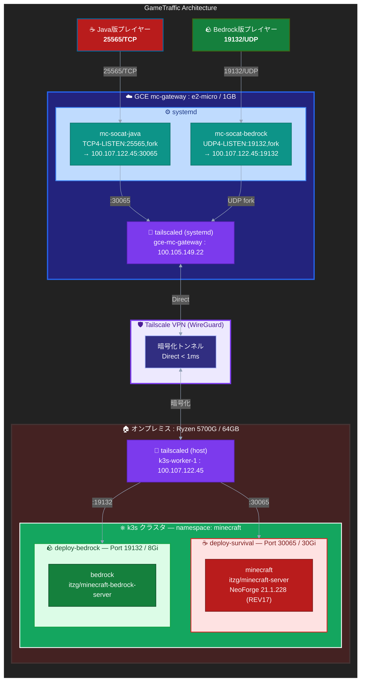
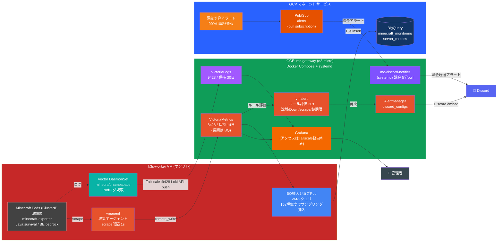

# TAK Pipeline - Hybrid Cloud Minecraft Infrastructure

**ハイブリッドクラウド構成によるMinecraftサーバー基盤**

[](LICENSE)


---

> **Status Platform（可視化）**: 本リポの監視基盤に相乗りする可視化ダッシュボード。公開 URL: [https://app.tagomori.dev](https://app.tagomori.dev)（リポ: [cloud-observability-gateway](https://github.com/Tagomori0211/cloud-observability-gateway)）。現行リポ名のまま運用。

## 📋 プロジェクト概要

本プロジェクトは、**オンプレミス（自宅サーバー）と Google Compute Engine を Tailscale VPN で接続**し、コスト効率と可用性を両立させた Minecraft サーバー基盤です。

Java版・Bedrock版の両対応に加え、**VictoriaMetrics + Grafana によるメトリクス可観測性**、**VictoriaLogs + Vector によるログ集約**、**BigQuery によるコスト・運用メトリクス分析**、**Discord による通知統合** までを Infrastructure as Code（IaC）で完全管理しています。

> **History**: 2026/05/03 に GKE クラスターから GCE VM 構成へ移行（コスト削減）。2026/05/07-08 に監視スタックを k3s 内 Prometheus から GCE 専用 VM 上の VictoriaMetrics + Grafana に再構築。2026/06 に VictoriaLogs + Vector ログパイプラインを追加し、メトリクス収集を 1 秒解像度へ、BigQuery 集積を k3s Pod（15 秒解像度）へ再設計。2026/09/30 に GCE の 3 台（入口 MIG・監視 VM・Status Platform VM）を e2-micro 1 台 `mc-gateway` に統合（公開 IP は維持）。

### 🎯 設計思想

| 観点 | アプローチ |
|------|-----------|
| **コスト最適化** | クラウドは GCE e2-micro 1 台（入口・監視）/ 重量級ワークロードはオンプレに集約 |
| **可用性** | クラウド側プロキシで世界中からの常時アクセスを保証 |
| **運用効率** | Terraform / Ansible / Kubernetes マニフェストで完全宣言的管理 |
| **セキュリティ** | Tailscale ゼロトラストネットワーク・公開ポートを最小化 |
| **可観測性** | メトリクス（vmagent → VictoriaMetrics）+ ログ（Vector → VictoriaLogs）を Grafana / BigQuery へ集約 |
| **通知統合** | 課金アラート・バックアップ完了・オンプレ沈黙検知を Discord に集約 |

---

## 🏗️ アーキテクチャ

### ゲームトラフィック


### 監視・通知系


---

## 🛠️ 技術スタック

### Infrastructure as Code

| ツール | バージョン | 用途 |
|--------|-----------|------|
| **Terraform** | >= 1.5.0 | GCE / VPC / IAM / BigQuery / Pub/Sub / Budget / Proxmox VM |
| **Ansible** | - | k3s + Tailscale インストール、Minecraft マニフェストデプロイ |
| **Kubernetes** | k3s v1.34 | オンプレ Minecraft サーバーのコンテナオーケストレーション |
| **Docker Compose** | - | mc-gateway: VictoriaMetrics / VictoriaLogs / Grafana / vmalert / Alertmanager |

### クラウド・インフラ

| サービス | 用途 |
|---------|------|
| **GCE: mc-gateway** (e2-micro / 単体 VM・静的IP 35.200.78.252) | 入口の透過プロキシ（systemd の socat: Java 25565 / Bedrock 19132）+ 監視スタック（VictoriaMetrics / VictoriaLogs / Grafana / vmalert / Alertmanager、Tailscale 経由のみアクセス可）+ 課金通知 + Status Platform |
| **BigQuery** | メトリクス時系列保存（k3s Pod が 15 秒解像度で INSERT）・課金 Export・コスト按分 VIEW |
| **Cloud Storage** (Standard) | ワールドバックアップ（月次: 31日 ARCHIVE / 365日削除、日次 `daily/`: 8日で削除） |
| **Pub/Sub** | 課金アラート（GCP Budget イベント駆動） |
| **Cloud Billing Budget** | 90% / 100% でTopic配信 |
| **Secret Manager** | Tailscale auth-key / Discord Webhook URL / Player hash salt |
| **Proxmox VE** | オンプレミス仮想化基盤（Ryzen 5700G / 64GB） |
| **Tailscale** | メッシュVPN（ゼロトラスト） |

### アプリケーション

| コンポーネント | イメージ |
|---------------|---------|
| socat (Java TCP / Bedrock UDP) | Ubuntu パッケージ `socat`（systemd） |
| Survival（休眠中） | `itzg/minecraft-server`  |
| Bedrock Server | `itzg/minecraft-bedrock-server` |
| Bedrock 監視（RakNet ping・MOTD 判定） | `python:3.12-alpine` + ConfigMap のスクリプト |
| VictoriaMetrics | `victoriametrics/victoria-metrics:v1.115.0` |
| vmagent | `victoriametrics/vmagent:v1.115.0` |
| VictoriaLogs | `victoriametrics/victoria-logs:v1.24.0-victorialogs` |
| Vector | `timberio/vector:0.56.0-debian` |
| vmalert | `victoriametrics/vmalert:v1.115.0` |
| Alertmanager（ネイティブ Discord 通知） | `prom/alertmanager:v0.28.1` |
| Grafana | `grafana/grafana:11.6.1` |

---

## ⚙️ 主要な設計ポイント

### 1. クラウド・オンプレ責任分担

```text
[ Internet ]
    │
    │ 25565/TCP, 19132/UDP
    ▼
[ GCE: mc-gateway (e2-micro) ]  ← 静的IP 35.200.78.252、24/365 公開エンドポイント
    │  systemd: mc-socat-java (Java) + mc-socat-bedrock (Bedrock)
    │  同居: 監視スタック（Docker Compose）・Status Platform
    │
    │ Tailscale 暗号化トンネル ≈ 20ms direct
    ▼
[ オンプレ k3s-worker (Ryzen 5700G / 64GB) ]
    └─ Survival（NeoForge 統合）/ Bedrock BDS（合計 46Gi JVM Request）
```

> **Note (2026-09-30)**: Java（Survival）は休眠中。Deployment は削除し、ワールドは PVC（`k8s/onprem/survival-pvc-dormant.yaml`）で保持している。再開は Helm で PVC を引き継いで行う。

「公開・薄いプロキシ層と監視」と「重量級ワークロード」を明確に分離。クラウド側は e2-micro 1 台（入口 + 監視 + Status Platform）に抑え、メモリ集約型のゲームサーバーをオンプレに寄せている。入口の socat は Docker に依存しない systemd サービスで、`OOMScoreAdjust=-900` によりメモリ逼迫時も最後まで残す。Velocity / nginx-stream は撤去済みで、Java は socat が NodePort へ直結する。

### 2. Bedrock UDP の透過転送（socat）

```ini
# gce/gateway/systemd/mc-socat-bedrock.service
ExecStart=/usr/bin/socat UDP4-LISTEN:19132,fork,reuseaddr UDP4:100.107.122.45:19132
```

Bedrock の RakNet は L7 プロキシで壊れるため、`fork` オプションでクライアント毎に独立 UDP ソケットを生成し Tailscale 経由で k3s `hostPort` まで一切改変せず透過転送。Java 側も同じく `mc-socat-java`（`TCP4-LISTEN:25565,fork` → `100.107.122.45:30065`）で svc-survival の NodePort へ直結しており、Velocity / nginx-stream といった中間プロキシ層を撤去している。

### 3. Tailscale ゼロトラストネットワーク

2 ノードの構成:

| ホスト名 | Tailscale IP | 役割 |
|---|---|---|
| `gce-mc-gateway` | 100.105.149.22 | 入口プロキシ（公開エンドポイント）+ VictoriaMetrics / VictoriaLogs / Grafana |
| `k3s-worker` | 100.107.122.45 | ゲームサーバー Pod |

GCE 側は `tailscaled` を host systemd（kernel mode）で起動。auth key は Secret Manager から VM 作成時の `cloud-init` で取得する（単体 VM のためノード状態はディスクに残り、再起動で再認証は不要）。Grafana は `0.0.0.0:3000` でリッスンするが GCE ファイアウォールで未開放のため、Tailscale ピアからのみ到達可能。

### 4. 監視スタック (VictoriaMetrics + VictoriaLogs + Grafana)

```text
[ k3s vmagent ]                       [ k3s Vector DaemonSet ]
    │ scrape 1s                            │ minecraft namespace の Pod ログ
    │ (Minecraft / cAdvisor)               │ read /var/log/pods
    │ remote_write via Tailscale           │ Loki API push via Tailscale
    ▼                                      ▼
[ GCE mc-gateway ]（e2-micro。各コンテナに mem_limit、swap 2GB）
    ├── VictoriaMetrics :8428 （保持 14日 / mem_limit 256m・1s 高解像度のため短縮、長期は BQ）
    ├── VictoriaLogs   :9428 （保持 30日 / mem_limit 128m）
    ├── node-exporter  127.0.0.1:9100（VictoriaMetrics が直接 scrape）
    └── Grafana :3000 （Tailscale 経由のみ・provisioning でデータソース／ダッシュボード自動投入）
```

- `gce/gateway/compose.yaml`: VictoriaMetrics + VictoriaLogs + Grafana + vmalert + Alertmanager を Docker Compose で起動
- `gce/gateway/grafana/provisioning/datasources/`: Grafana に VictoriaMetrics / VictoriaLogs データソースを自動投入
- `gce/gateway/grafana/dashboards/`: Bedrock / オンプレ / GCE 概況のダッシュボード（Java 用は休眠中も保持）
- `k8s/onprem/30-victoria-metrics.yaml`: vmagent + RBAC（cAdvisor は参照される系列だけ送信、Minecraft は scrape_interval 1s）
- `k8s/onprem/42-vector-daemonset.yaml`: Vector DaemonSet（minecraft namespace のログを VictoriaLogs へ直接送信）

### 5. BigQuery メトリクス収集

k3s 内の **BQ 挿入ジョブ Pod** が VictoriaMetrics（1 秒解像度）へクエリを投げ、**15 秒解像度にサンプリング**して BigQuery へストリーミング INSERT する。VM=1s / BQ=15s の二段集積構成。

```text
[ VictoriaMetrics :8428（1s 解像度） ]
        │ PromQL query
        ▼
[ k3s BQ 挿入ジョブ Pod ] ── 15s サンプリング ──▶ [ BigQuery server_metrics ]
```

- `Terraform/minecraft_monitoring.tf`: dataset `minecraft_monitoring` / table `server_metrics`（DAY パーティション + clustering=[server, metric_name]）
- `k8s/onprem/` BQ 挿入ジョブ: stdlib のみ・ADC override（`CLOUDSDK_AUTH_CREDENTIAL_FILE_OVERRIDE`、SA キー作成禁止 org policy 対応）・`avg_over_time` / `max_over_time` で 15 秒集計
- BigQuery `gcp_billing_export` × `server_metrics` を JOIN した **`cost_analysis_view`** によりプレイヤー比率で按分したコスト分析が可能（Looker Studio 接続向け）

### 6. メトリクスアラート（vmalert + Alertmanager）

メトリクス由来のアラートは **vmalert → Alertmanager → Discord** の標準構成に統一。Alertmanager のネイティブ `discord_configs` で Discord embed を直接送る（中継ブリッジ不要）。

```text
[ VictoriaMetrics ] ──評価(30s)──▶ [ vmalert ] ──発火──▶ [ Alertmanager 127.0.0.1:9093 ] ──▶ Discord embed
```

- `gce/gateway/vmalert/rules/minecraft.yml`: `OnpremSilence`（オンプレ沈黙）/ `MinecraftServerDown` / `BedrockUnjoinableNoMOTD` / `ScrapeTargetDown` / `TailscaleAuthKeyExpiringSoon`（鍵発行+80日）
- `gce/gateway/alertmanager/alertmanager.yml`: `discord_configs` + `webhook_url_file`。webhook URL は Secret Manager から cloud-init がファイル（`secrets/discord_webhook`、0400）に生成
- **オンプレ沈黙検知**は `OnpremSilence`（`absent(up{location="onprem"}==1)` 5分）ルールで行う

### 7. 課金アラート（Pub/Sub Pull）

課金（GCP Budget）はメトリクスでなくイベント駆動のため、**mc-gateway 上の mc-discord-notifier（systemd・5 分 pull）** が Pub/Sub から取得して Discord 通知する（vmalert 対象外）。Cloud Functions push は Cloudflare の ASN ブロックで 403 になるため pull 構成。

```text
[ Cloud Billing Budget ¥8,000/月 ] ─90/100%─▶ [ Pub/Sub ] ◀─pull(5min)─ [ mc-discord-notifier ] ─▶ Discord
```

- `Terraform/notifications.tf`: Pub/Sub topic + pull subscription + Budget + Secret Manager
- 月次バックアップ完了時にも `gcs-backup-cronjob` が **署名付き URL（12時間有効）** 付き embed を Discord に送信

### 8. GCS Standard バックアップ

```yaml
# Terraform/gcs_backup.tf
storage_class = "STANDARD"
location      = "ASIA-NORTHEAST1"
lifecycle_rule {
  age = 31  → ARCHIVE
  age = 365 → 削除
  age = 8 / prefix daily/ → 削除
}
```

k3s の `gcs-backup-cronjob`（毎月1日 03:00 JST）と `gcs-daily-backup-cronjob`（2〜31日 04:00 JST、`daily/`）が Bedrock ワールド（Java 再開時は Survival も）を `tar.gz` 化して GCS にアップロード。署名付き URL 生成には `mc-proxy-sa` への `roles/iam.serviceAccountTokenCreator` 委譲を Terraform で設定済み。

### 9. Secret 管理

Secret Manager で以下を管理:

| Secret 名 | 用途 |
|---|---|
| `tailscale-auth-key` | mc-gateway 作成時の cloud-init で `tailscale up` |
| `mc-discord-webhook-url` | メトリクスアラート（Alertmanager）・課金アラート・バックアップ通知の Webhook |
| `mc-player-hash-salt` | プレイヤー XUID の SHA256 ハッシュ用 256-bit salt（`Terraform/privacy.tf`） |

ハードコードを徹底排除し、SA に最小権限の `roles/secretmanager.secretAccessor` のみ付与。

---

## 💰 コスト削減実績

### アーキテクチャ進化

| フェーズ | 構成 | 月額コスト | 備考 |
|---|---|---:|---|
| Phase 0: 全クラウド見込み | 全コンポーネント GKE 上 | 約 35,000 円 | 当初試算（未実装） |
| Phase 1: GKE Hybrid | GKE Standard + オンプレ k3s | 約 19,700 円 | Phantom LB / Cloud NAT 等を含む |
| Phase 2: GCE 移行 (2026/05/03) | GCE mc-proxy-1 + オンプレ k3s | 約 3,680 円 | GKE 削除・LB 統合・NAT 廃止 |
| Phase 3: 可観測性追加 (2026/05〜09) | + mc-monitoring-1 + BQ + Pub/Sub（+ Status Platform VM） | 約 7,000 円（Status Platform VM 追加後の 2026/09 実績 約 11,700 円） | 監視 VM・課金予算 ¥8,000/月 |
| **Phase 4: GCE 1 台に統合 (2026/09/30〜・現在)** | **mc-gateway（e2-micro）+ BQ + Pub/Sub** | **約 4,100 円（見込み）** | **入口 MIG・監視 VM・Status Platform VM を統合** |

主な削減要因:
- **GKE 削除**: コントロールプレーン費用・Phantom LB（¥2,700）・Cloud NAT（¥4,500）・nginx-gw-bedrock LB（¥2,700）が消滅
- **LB 統合**: Java/Bedrock 別 IP（¥2,700×2）→ 単一静的 IP 35.200.78.252
- **メモリ集約**: 高価なクラウドメモリを回避し JVM プロセスをオンプレ Ryzen 5700G / 64GB に集約
- **GCE 統合**: e2-micro + e2-small ×2・外部 IP 3 個 → e2-micro 1 台・静的 IP 1 個（Compute Engine 約 ¥9,870 → 約 ¥2,300 見込み）

### VPS との比較（参考: 2026年5月時点・税込）

同等のゲーム機能（Survival〔NeoForge 統合 MOD〕+ Bedrock BDS = 約 18〜24GB メモリ）を国内 VPS で構築した場合:

| 構成 | 月額 | 年額 | 現構成との差 |
|---|---:|---:|---:|
| **🏆 現構成 (GCE Hybrid)** | **約 4,100 円（見込み）** | **約 49,200 円** | 基準 |
| Xserver VPS 24GB（36ヶ月契約） | 7,200 円 | 86,400 円 | +37,200 円/年 |
| Xserver VPS 12GB + 24GB（思想維持） | 10,800 円 | 129,600 円 | +80,400 円/年 |
| さくらVPS 32G（12ヶ月一括） | 26,400 円 | 316,800 円 | +267,600 円/年 |

シングル VPS より安い価格帯で「Terraform 管理・k3s・Tailscale ゼロトラスト・VictoriaMetrics 監視・BigQuery コスト分析・Discord 通知一式」を実現している。

#### 真の TCO（オンプレ運用の隠れコストを含む）

| 項目 | 月額換算 |
|---|---:|
| 電気代（Ryzen 5700G 60W 平均 / 30円/kWh） | 約 1,290 円 |
| ハードウェア減価償却（取得 15万円 / 36ヶ月） | 約 4,170 円 |
| 自宅 10GbE 回線（按分） | 約 1,000 円 |
| **クラウド支出** | **約 4,100 円（見込み）** |
| **真の TCO 合計** | **約 10,560 円/月** |

---

## 📊 実証された成果

| 指標 | 結果 |
|------|------|
| **月間クラウド支出** | 約 ¥4,100 見込み（mc-gateway + BQ + Pub/Sub。統合前の 2026/09 実績は約 ¥11,700）|
| **グローバル遅延** | Tailscale Direct ≈ 20ms（東京リージョン経由）|
| **デプロイ時間** | Terraform `apply` 約 15 分（VM 作成 + cloud-init で Docker・監視スタックを導入） |
| **観測サイクル** | scrape 1秒（VM）/ BQ 集積 15秒 / Discord pull 5分 / 沈黙検知 5分 |
| **バックアップ** | GCS に月次（1年保持）+ 日次（8日保持）を k3s CronJob で保存 |
| **コスト分析粒度** | プレイヤー比率按分（cost_analysis_view）|

---

## 📝 ロードマップ

### ✅ 完了（2026年5月）

- GKE → GCE 移行・LB 統合・NAT 廃止
- Velocity / nginx-stream 撤去（Java は socat-tcp → NodePort 直結）
- VictoriaMetrics + Grafana スタックを GCE 専用 VM へ移行
- BigQuery `cost_analysis_view`（課金 Export × server_metrics 日次 JOIN）
- GCS バックアップを STANDARD 化（毎月1日・lifecycle 31日 ARCHIVE / 365日削除）
- 課金アラート Discord 通知（Pub/Sub pull subscription）
- 月次バックアップ Discord 通知（署名付き URL 12時間有効）
- プライバシー設計（player_hash_salt by Secret Manager）

### ✅ 完了（2026年6月）

- VictoriaLogs + Vector ログ収集パイプライン追加（minecraft namespace のログを Grafana へ集約）
- メトリクス収集を 1 秒解像度へ・BigQuery 集積を k3s Pod（15 秒解像度）へ再設計
- mc-proxy を autohealing MIG 化（TCP:25565 ヘルスチェック・静的IP 維持）
- メトリクスアラートを vmalert + Alertmanager + alertmanager-discord に統一（オンプレ沈黙は vmalert ルール化、課金は Pub/Sub 継続）
- [Status Platform](https://github.com/Tagomori0211/cloud-observability-gateway) : Kotlin API + Flutter Web + Envoy + Cloudflare Tunnel

### ✅ 完了（2026年9月）

- GCE 3 台（入口 MIG・監視 VM・Status Platform VM）を e2-micro 1 台 `mc-gateway` に統合（公開 IP 35.200.78.252 は維持）
- Alertmanager をネイティブ Discord 通知へ移行し、alertmanager-discord ブリッジと Vector aggregator を廃止
- 日次バックアップを GCS へ移行（MinIO 廃止）、Java（Survival）を休眠化（ワールド PVC は保持）
- k3s の cAdvisor 送信を参照される系列だけに絞り込み

### 🔲 今後

- [ ] **Looker Studio ダッシュボード**: cost_analysis_view を基にした公開向けレポート
- [ ] **External Secrets Operator**: k3s Secret 管理の外部化

- [ ] **Disaster Recovery 手順**: バックアップからのリストア演習・runbook 文書化
- [ ] **Argo CD 導入**: k3s マニフェストの GitOps 化

---

## 📜 ライセンス

MIT License - 詳細は [LICENSE](LICENSE) を参照

---

## 👤 Author

**HN: 田籠 勇吉 (Tagomori Yukichi)**

- GitHub: [@tagomori0211](https://github.com/tagomori0211)
- Portfolio: インフラエンジニア / SRE志望

---

> **Note**: 本プロジェクトは、クラウドとオンプレミスのハイブリッド構成における
> Infrastructure as Code の実践的なポートフォリオとして構築されました。
